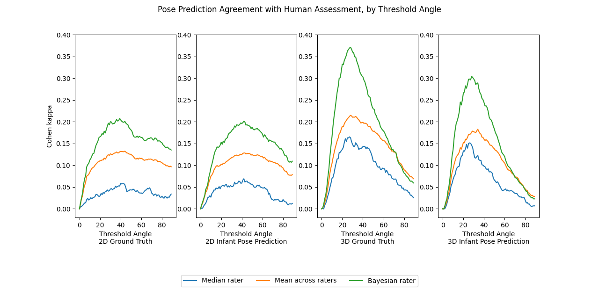

# Infant Postural Symmetry Measurement

Codes and experiments for the following paper: 

Xiaofei Huang, Michael Wan, Lingfei Luan, Bethany Tunik, Sarah Ostadabbas, “Computer Vision to the Rescue: Infant Postural Symmetry Estimation from Incongruent Annotations," July 2022.

Contact: 

[Xiaofei Huang](xhuang@ece.neu.edu)

[Sarah Ostadabbas](ostadabbas@ece.neu.edu)

## Table of Contents
  * [Introduction](#introduction)
  * [Environment](#environment)
  * [Data preparation](#data-preparation)
  * [How to use](#how-to-use)
  * [Citation](#citation)
  * [Acknowledgments](#acknowledgments)
  * [License](#license)

## Introduction
Bilateral postural symmetry plays a key role as a potential risk marker for autism spectrum disorder (ASD) and as a symptom of congenital muscular torticollis (CMT) in infants. Therefore, we develop a computer vision based infant symmetry assessment system, leveraging 3D human pose estimation for infants.
To evaluation and calibration of our system against ground truth assessments, we develop a Bayesian estimator of the ground truth derived from a probabilistic graphical model of fallible human raters.

## Environment
The code is developed using python 3.6 on Ubuntu 18.04.
Please install dependencies:
   ```
   pip install -r requirements.txt
   ```

## Data Preparation
(1) 2D keypoints ground truth comes from [SyRIP dataset](https://coe.northeastern.edu/Research/AClab/SyRIP/). 
(2) For 2D keypoints prediction, [FiDIP model](https://arxiv.org/abs/2010.06100) is applied to estimate infant 2D pose from image. 
(3) For 3D keypoints prediction, [HW-HuP mdoel for infant](https://arxiv.org/abs/2105.10996) is applied to estimate infant 3D pose and camera parameters from image.
(4) 3D keypoints correction, which is regarded as weak ground truth, is obtained by using modified [EvoSkeleton annotation tool](https://github.com/Nicholasli1995/EvoSkeleton) to manually correct the previous predicted 3D keypoints locations.
(5) The human rating data of survey, which is conducted on 10 human raters for their assessments of pose symmetry and angle differences in four pairs of limb across 700 SYRIP infant images, is saved in 'asymmetryanalysisALL.xlsx' file. 
The order of survey images is mapped to the original image names of SyRIP 700 real data and saved in 'img_name700_map.npy'.

All above input data resources are placed as follows:
   ```
   ${SYMMETRY_ROOT}
   ├── data
   |    ├── SyRIP_2d_gt
   |    |       └── preson_keypoints_validate_infant.json
   |    ├── SyRIP_2d_pred
   |    |       └── keypoints_validate_infant_results_0.json
   |    ├── SyRIP_3d_correction
   |    |       └── correct_3D.npy
   |    ├── SyRIP_3d_pred
   |    |       ├── output_imgnames.npy
   |    |       └── output_pose_3D.npy
   |    └── survey_data
   |            ├── asymmetryanalysisAll.xlsx
   |            └── img_name700_map.npy
   ├── outputs
   :
   :
   ├── requirements.txt
   └── README.md
   
   ```

## How to use

### Bayesian Aggregation
To estimate symmetry and angle ground truth from human ratings, please run `em_sym.py` and `em_ang.py`, respectively. And the results will be saved in `outputs ` folder.

### Angle Threshold Searching
Run `angle_threshold.py` to find the optimal threshold for the pose-based symmetry assessments which maximize agreement with human ratings. 


### Pose-based Symmetry Measurement
Run `measurement_3d_pred.py` to produce `angles_syrip_3d_pred.csv` and `rating_syrip_3d_pred_thres28.csv` files in `outputs` folder. Other types of pose-based measurement can be used in the same way.
You can also change the angle threshold value in the script.

## Citation

If you use our code or models in your research, please cite these paper:

```
@inproceedings{huang2022isymmetry,
  title={Computer Vision to the Rescue: Infant Postural Symmetry Estimation from
Incongruent Annotations},
  author={Huang, Xiaofei and Wan, Michael and Luan, Lingfei and Tunik, Bethany and  Ostadabbas, Sarah},
  booktitle={arXive preprint: https://arxiv.org/pdf/2207.09352v1.pdf},
  month     = {July},
  year      = {2022}
}
```
```
@inproceedings{huang2021infant,
  title={Invariant Representation Learning for Infant Pose Estimation with Small Data},
  author={Huang, Xiaofei and Fu, Nihang and Liu, Shuangjun and Ostadabbas, Sarah},
  booktitle={IEEE International Conference on Automatic Face and Gesture Recognition (FG), 2021},
  month     = {December},
  year      = {2021}
}
```


## Acknowledgement
Thanks for the interactive 3D annotation tool
* [Cascaded Deep Monocular 3D Human Pose Estimation With Evolutionary Training Data, Li, Shichao and Ke, Lei and Pratama, Kevin and Tai, Yu-Wing and Tang, Chi-Keung and Cheng, Kwang-Ting](https://github.com/Nicholasli1995/EvoSkeleton)


## License 
* This code is for non-commercial purpose only. 
* For further inquiry please contact: Augmented Cognition Lab at Northeastern University: http://www.northeastern.edu/ostadabbas/ 


